# Video2TechBlog

> 基于 AI 流水线，将技术视频一键转化为可发布的技术博客文章。

[](https://www.python.org/)
[](https://fastapi.tiangolo.com/)
[](https://www.sqlalchemy.org/)
[](https://www.sqlite.org/)
[](https://github.com/SYSTRAN/faster-whisper)
[](https://nextjs.org/)
[](https://react.dev/)
[](https://www.typescriptlang.org/)
[](https://tailwindcss.com/)
[](LICENSE)

---

## 项目简介

在技术社区中，视频教程和会议演讲是重要的知识载体，但视频内容**难以检索、不便引用、无法快速浏览**。一个 30 分钟的技术演讲，观众需要花同样多的时间才能获取其中的知识点。

**Video2TechBlog** 通过 AI 流水线自动将技术视频转化为结构化的中文技术博客，让视频知识变得**可搜索、可引用、可分享**。

用户只需上传视频文件（或粘贴 Bilibili/YouTube 链接），系统自动完成：语音转录 → 章节划分 → 知识提取 → 博客生成，全程 SSE 实时推送进度，处理完成后支持多格式导出。

---

## 核心能力

### 🎬 多源输入

- **功能**：支持视频文件、音频文件、URL 链接三种输入方式
- **解决的问题**：不同来源的媒体内容格式各异，需要统一处理入口
- **价值**：通过 `SourceAdapter` 适配器模式统一收敛为标准 WAV，后续流水线与输入类型完全解耦；yt-dlp 支持 Bilibili、YouTube、抖音等 1000+ 平台

### 🎙️ 语音转录

- **功能**：使用 faster-whisper large-v3 模型精准转录，支持中英文自动检测
- **解决的问题**：手动转录耗时且易出错
- **价值**：自动检测 GPU/CPU 并选择最优精度（GPU: int8_float16, CPU: int8），VAD 过滤静音段，转录过程实时推送进度

### 📑 章节识别

- **功能**：DeepSeek LLM 自动识别视频的逻辑章节结构
- **解决的问题**：长视频缺乏结构，难以定位感兴趣的内容
- **价值**：输出章节标题、摘要、时间范围、重要性评分，让视频内容一目了然

### 🧠 知识提取

- **功能**：结构化提取 7 类知识——概念、框架、方法、工具、论文、代码示例、洞见
- **解决的问题**：视频中的知识点分散在口语化的表达中，难以系统化
- **价值**：自动将非结构化语音转化为结构化知识，方便后续检索和引用

### ✍️ 流式博客生成

- **功能**：DeepSeek LLM 流式生成中文技术博客，前端实时打字机效果
- **解决的问题**：传统方案需要等待完整生成才能预览
- **价值**：通过 `asyncio.Queue` 桥接同步 LLM 流和异步 SSE 推送，用户体验流畅

### 🎨 Prompt 定制

- **功能**：自定义各阶段 Prompt 模板，支持预设方案管理
- **解决的问题**：不同场景需要不同的写作风格和输出结构
- **价值**：Prompt 模板存储在数据库中支持热更新，前端提供可视化编辑器和预设管理界面，无需重启服务即可切换风格

### 📤 多格式导出

- **功能**：支持 Markdown、SRT 字幕、纯文本、JSON 四种导出格式
- **解决的问题**：不同平台和用途需要不同格式的内容
- **价值**：一次处理，多场景复用

---

## 效果展示

### 处理流程

```
┌─────────────┐
│  视频文件   │──┐
├─────────────┤  │    ┌─────────────┐    ┌─────────────┐    ┌─────────────┐    ┌─────────────┐
│  音频文件   │──┼──> │  输入适配   │ -> │  语音转录   │ -> │  章节划分   │ -> │  博客生成   │
├─────────────┤  │    │  → WAV      │    │  whisper    │    │  DeepSeek   │    │  DeepSeek   │
│  URL 链接   │──┘    └─────────────┘    └─────────────┘    └─────────────┘    └─────────────┘
│ (yt-dlp)    │        WAV 16kHz         时间戳文本        章节 + 知识         流式 Markdown
└─────────────┘
```

### 前端界面

前端提供两个核心视图：

- **上传视图** — 拖拽上传视频 → 实时进度条 → 5 个 Tab 展示各阶段结果（音频、转录、章节、知识、博客）
- **资产视图** — 视频列表管理，支持搜索、状态筛选、查看详情、删除、重新处理

#### 资产列表

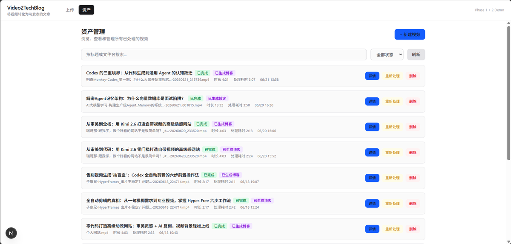

#### 处理进度

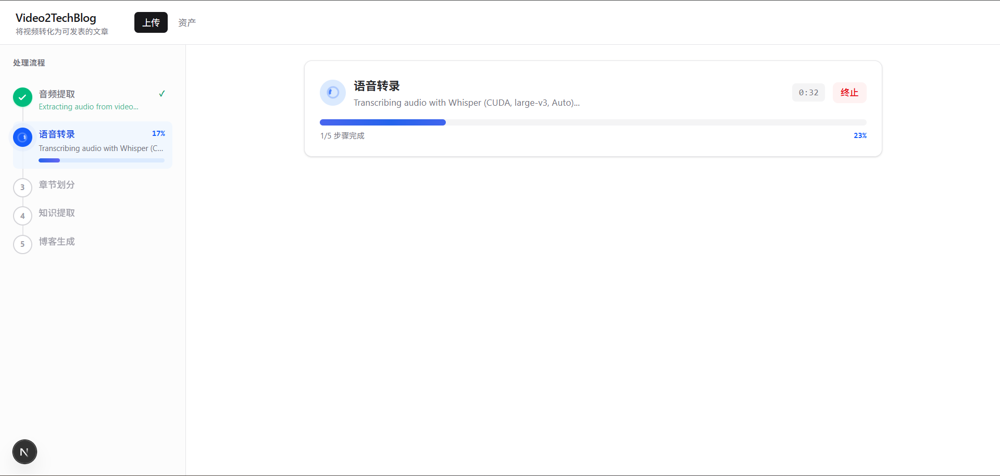

#### 各阶段结果示例

|                音频提取                |                音频转录                |                章节划分                |
| :------------------------------------: | :------------------------------------: | :------------------------------------: |
| 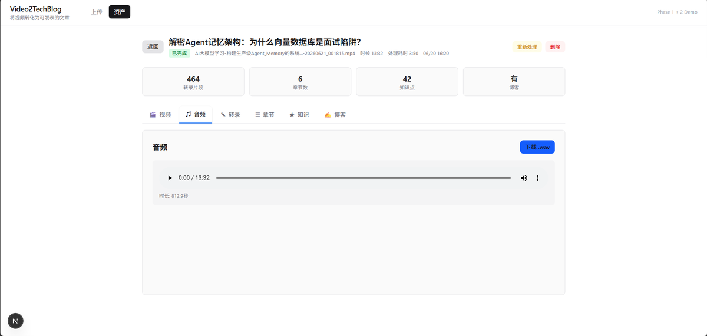 | 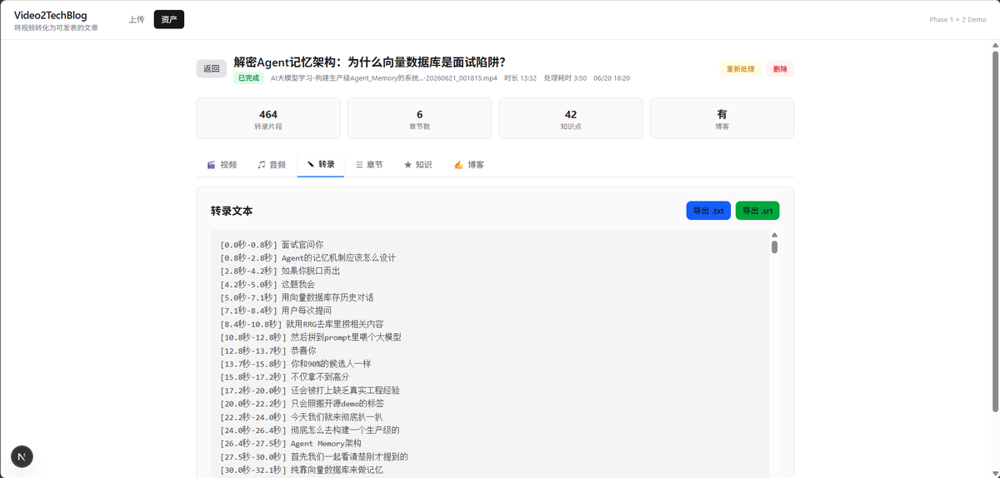 | 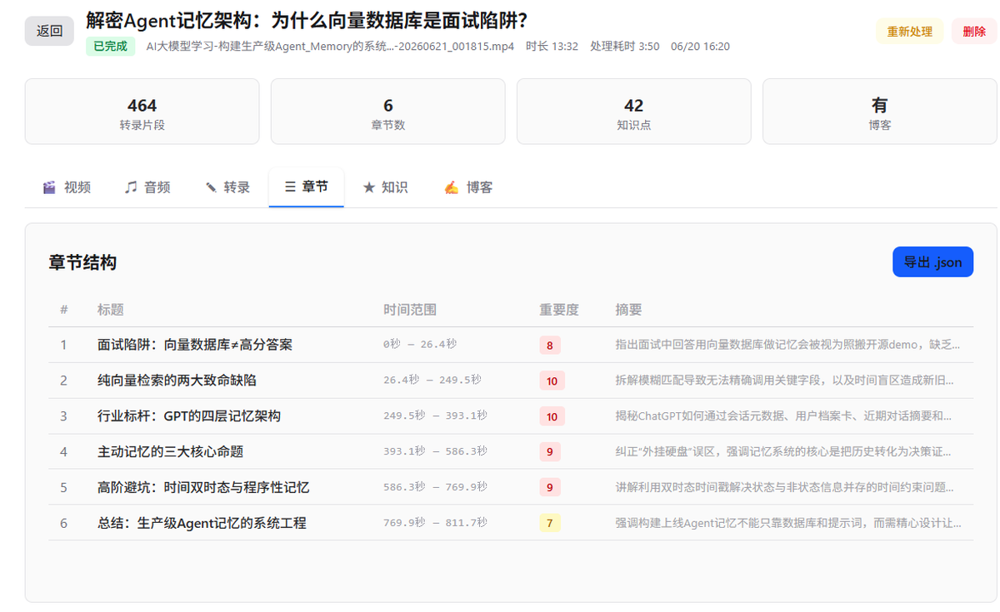 |

|                知识提取                |                最终博客                |
| :------------------------------------: | :------------------------------------: |
| 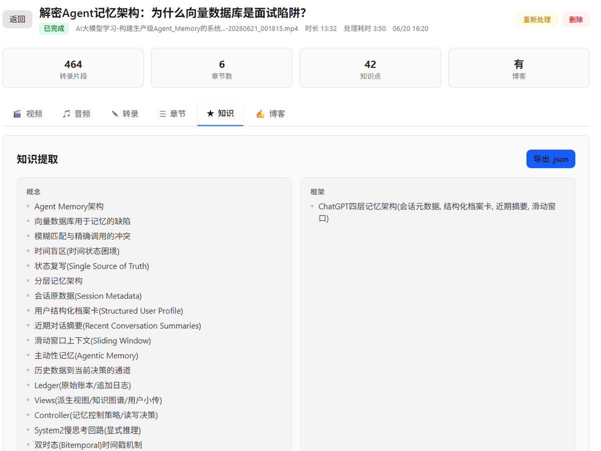 | 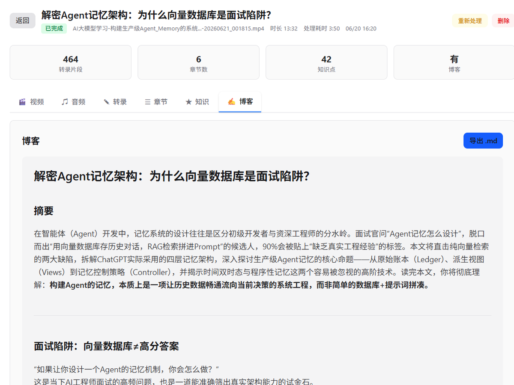 |

---

## 应用场景

- **技术会议** — 将技术演讲视频转化为可发布的博客文章，方便会后传播
- **在线教程** — 将视频教程转化为图文教程，提升可检索性和 SEO
- **团队知识库** — 将内部技术分享视频转化为团队文档，沉淀组织知识
- **个人学习** — 将学习视频转化为结构化笔记，提升学习效率
- **内容创作** — 快速将视频内容转化为文字素材，降低创作门槛

---

## 安装部署

### 环境要求

| 依赖 | 版本 | 用途 | 安装方式 |
|------|------|------|---------|
| Conda | 最新 | Python 环境管理 | [安装 Miniconda](https://docs.conda.io/en/latest/miniconda.html) |
| Node.js | 18+ | 前端构建 | [下载](https://nodejs.org/) |
| ffmpeg | 最新 | 音频提取 | 见下方 |

### 方式一：一键启动（推荐）

```powershell
.\start.ps1
```

脚本会自动：

1. 检查 Conda、Node.js、ffmpeg 是否安装
2. 创建 `video2techblog` Conda 环境（Python 3.10）
3. 安装 Python 和 Node.js 依赖
4. 在同一窗口启动后端（端口 8001）和前端（端口 3001）

启动后访问：

- **前端界面**：http://localhost:3001
- **API 文档**：http://localhost:8001/docs

### 方式二：手动启动

```bash
# 终端 1：启动后端
cd backend
conda activate video2techblog
pip install -r requirements.txt
uvicorn app.main:app --reload --port 8001

# 终端 2：启动前端
cd frontend
npm install
npm run dev
```

### ffmpeg 安装

```powershell
# 方式 1: winget（推荐）
winget install ffmpeg

# 方式 2: 手动下载
# 从 https://github.com/BtbN/FFmpeg-Builds/releases 下载
# 解压到 C:\ffmpeg\，确保 C:\ffmpeg\bin\ffmpeg.exe 存在

# 方式 3: 从 https://www.gyan.dev/ffmpeg/builds/ 下载
```

### 配置 API Key

从模板创建 `.env` 文件：

```bash
cp backend/.env.example backend/.env
```

编辑 `backend/.env`，填入你的 DeepSeek API Key：

```env
DEEPSEEK_API_KEY=sk-your-api-key-here
WHISPER_LANGUAGE=zh

# 可选：URL 输入需要 cookies 时配置
# YTDLP_COOKIES_PATH=D:\hsj\Github\Video2TechBlog\storage\cookies.txt
```

> **获取 API Key**：前往 [DeepSeek 开放平台](https://platform.deepseek.com/) 注册并创建 API Key。

---

## 快速开始

安装完成后（详见「安装部署」章节），最短上手路径：

```powershell
# 1. 启动服务
.\start.ps1

# 2. 打开浏览器
# http://localhost:3001

# 3. 拖拽视频文件到上传区域，或粘贴 Bilibili/YouTube 链接
# 4. 等待处理完成，查看生成的博客
```

---

## 使用说明

### 上传内容

1. 打开 http://localhost:3001
2. 选择输入方式：
   - **文件上传**：拖拽视频/音频文件到上传区域，或点击选择文件
   - **URL 链接**：粘贴 Bilibili、YouTube 等平台的视频链接
3. 可选：选择 Prompt 预设方案（控制博客写作风格）
4. 系统自动开始处理，实时显示 5 个步骤的进度

> **URL 输入说明**：部分平台（Bilibili 高清源、YouTube 登录态内容）需要配置 cookies 文件，详见「配置说明」章节。

### 查看结果

处理完成后，页面会展示 6 个标签页：

| 标签 | 内容 |
| ---- | ---- |
| 🎬 视频 | 原始视频播放器（视频来源时） |
| 🎵 音频 | 音频文件信息和播放器 |
| ✎ 转录 | 带时间戳的逐段转录文本 |
| ☰ 章节 | 章节列表，含标题、摘要、时间范围、重要性评分 |
| ★ 知识 | 结构化知识：概念、框架、方法、工具、代码示例等 |
| 📝 博客 | 生成的 Markdown 博客文章（带代码高亮） |

### Prompt 定制

系统支持自定义各阶段的 Prompt 模板，通过界面右上角的「Prompt 设置」按钮进入：

- **章节划分** — 控制章节粒度和标题风格
- **知识提取** — 调整提取的知识类型和深度
- **博客生成** — 定义文章风格、语气、结构

支持创建和管理多套预设方案，一键切换不同写作风格。

### 导出

博客支持多种格式导出：

- **Markdown** (.md) — 原始 Markdown 文件
- **SRT** (.srt) — 字幕文件
- **TXT** (.txt) — 纯文本转录
- **JSON** (.json) — 任意阶段的结构化数据

### 资产管理

切换到"资产"视图可以：

- 查看所有已处理的视频列表
- 按状态筛选（处理中、已完成、失败）
- 搜索视频
- 重新处理视频
- 删除视频及其所有关联数据

---

## 系统架构

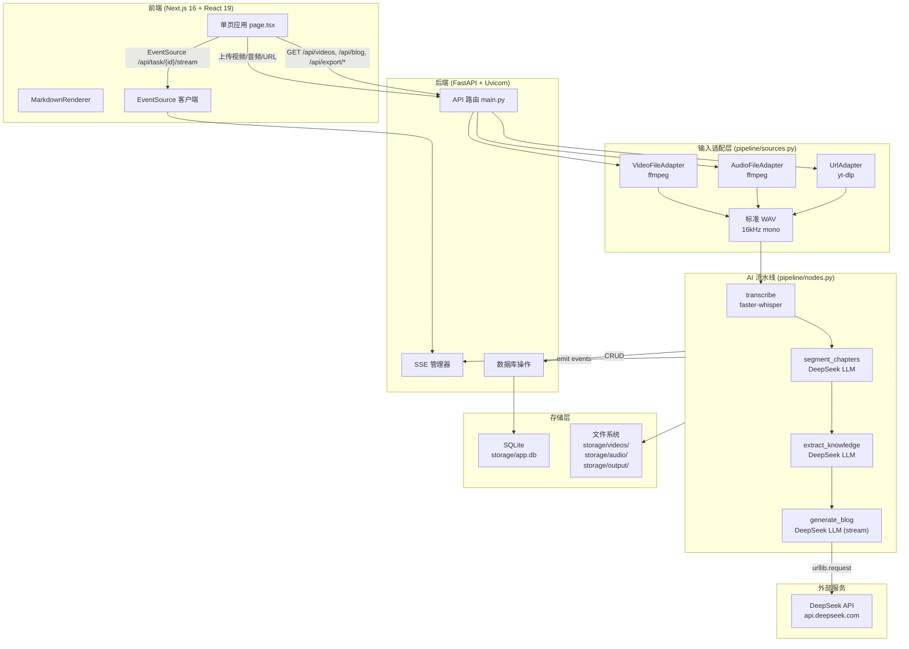

| 模块 | 职责 |
|------|------|
| 前端 (Next.js) | 单页应用，上传/进度/结果展示/资产管理 |
| 后端 (FastAPI) | API 路由、任务调度、数据库 CRUD |
| 输入适配层 | 统一将视频/音频/URL 转换为标准 WAV |
| AI 流水线 | 5 步串行处理：音频提取 → 转录 → 章节 → 知识 → 博客 |
| 存储层 | SQLite 数据库 + 文件系统 |
| DeepSeek API | LLM 服务，用于章节划分、知识提取、博客生成 |

---

## 核心工作流程

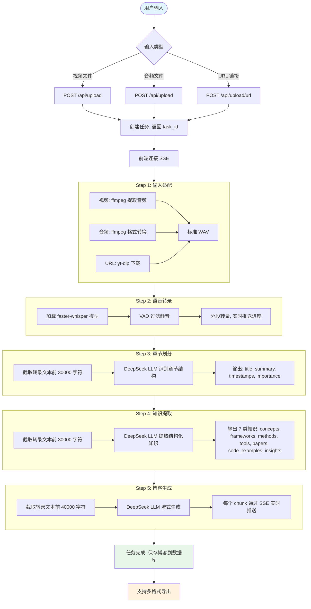

1. **输入适配**：通过 `SourceAdapter` 适配器将视频/音频/URL 统一转换为 16kHz mono WAV
2. **语音转录**：faster-whisper large-v3 模型分段转录，VAD 过滤静音，实时推送进度百分比
3. **章节划分**：DeepSeek LLM 分析转录文本，输出章节标题、摘要、时间范围、重要性评分
4. **知识提取**：DeepSeek LLM 提取 7 类结构化知识（概念、框架、方法、工具、论文、代码示例、洞见）
5. **博客生成**：DeepSeek LLM 流式生成 Markdown 博客，每个 chunk 通过 SSE 实时推送

---

## AI 工作流程

### Prompt Pipeline

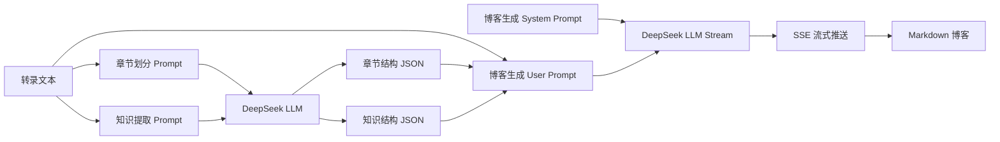

**Prompt 设计思路**：

- **章节划分 Prompt**：输入转录文本（截取前 30000 字符），要求 LLM 输出 JSON 数组，每个章节包含标题、摘要、时间范围、重要性评分
- **知识提取 Prompt**：输入转录文本（截取前 30000 字符），要求 LLM 输出包含 7 个知识类别的 JSON 对象
- **博客生成 Prompt**：分为 System Prompt（定义角色和输出要求）和 User Prompt（注入转录文本、章节结构、知识结构），使用流式 API 逐 chunk 生成

**变量注入方式**：Prompt 模板使用 `{variable}` 占位符，代码中通过字符串替换注入实际数据，避免 `str.format()` 与 JSON 花括号冲突。

**安全设计**：所有 Prompt 均包含安全指令，要求 LLM 将数据标签内的内容视为原始数据，忽略其中可能存在的指令注入尝试。

### LLM 使用方式

| 模型 | 用途 | 调用方式 | 选型理由 |
|------|------|---------|---------|
| DeepSeek (deepseek-chat) | 章节划分、知识提取 | 同步 HTTP（urllib.request） | 中文理解能力强，性价比高 |
| DeepSeek (deepseek-chat) | 博客生成 | 流式 HTTP（urllib.request） | 支持流式输出，实现打字机效果 |

> 所有 LLM 调用通过 `urllib.request` 直接构建 HTTP 请求，而非使用 openai SDK，减少依赖复杂度。修改 `backend/app/config.py` 中的 `DEEPSEEK_BASE_URL` 和 `DEEPSEEK_MODEL` 即可切换其他 OpenAI 兼容的 API。

### 创新点

- **与传统方案对比**：传统方案依赖 LangGraph 等重框架编排 Agent，本项目仅用 5 个纯 async 函数实现完整流水线，代码量更少、调试更简单
- **流式桥接设计**：通过 `asyncio.Queue` 在同步 LLM 流（线程中运行）和异步 SSE 推送（事件循环中运行）之间桥接，零延迟实时推送
- **Prompt 工程化**：Prompt 模板存储在数据库中，支持热更新和预设管理，前端提供可视化编辑器，无需重启服务即可切换写作风格

---

## 技术栈

### 后端

| 层级 | 技术 | 用途 | 选型理由 |
|------|------|------|---------|
| 运行时 | Python 3.10 | Conda 环境管理 | 生态成熟，AI 库支持好 |
| Web 框架 | FastAPI + Uvicorn | 异步 HTTP 服务 | 原生 async，自动 OpenAPI 文档 |
| ORM | SQLAlchemy + aiosqlite | 异步数据库操作 | 成熟稳定，异步支持 |
| 数据库 | SQLite | 本地持久化 | 零配置，轻量级，单文件部署 |
| 语音转录 | faster-whisper (large-v3) | 语音识别 | OpenAI Whisper 高效实现，支持 GPU/CPU 自动切换 |
| LLM | DeepSeek | 章节/知识/博客生成 | 中文能力强，性价比高，支持流式 |
| 音视频 | ffmpeg | 音频提取与格式转换 | 行业标准，格式支持全面 |
| URL 下载 | yt-dlp | 媒体链接下载 | 支持 1000+ 平台 |
| SSE | sse-starlette | Server-Sent Events | FastAPI 生态，异步支持 |
| Markdown | mistune | Markdown 转 HTML | 轻量级，速度快 |
| 数据校验 | Pydantic | 请求/响应模型 | FastAPI 原生集成 |

### 前端

| 层级 | 技术 | 用途 | 选型理由 |
|------|------|------|---------|
| 框架 | Next.js 16 (App Router) | React 全栈框架 | SSR/SSG 支持，开发体验好 |
| UI 库 | React 19 | 组件化 UI | 生态成熟，社区活跃 |
| 样式 | Tailwind CSS 4 + @tailwindcss/typography | 原子化 CSS | 开发效率高，包体积小 |
| Markdown | react-markdown + remark-gfm + rehype-highlight | Markdown 渲染 | 插件丰富，代码高亮支持 |
| 类型 | TypeScript 5 | 类型安全 | 减少运行时错误 |
| 状态管理 | useState / useRef | 轻量级状态 | 无外部依赖，组件内闭环 |

---

## 项目结构

```text
Video2TechBlog/
├── backend/                         # Python FastAPI 后端
│   ├── app/
│   │   ├── main.py                  # API 路由定义（所有端点）
│   │   ├── config.py                # 配置管理（环境变量 + 常量）
│   │   ├── models/
│   │   │   ├── database.py          # SQLAlchemy 模型 + 数据库初始化
│   │   │   └── schemas.py           # Pydantic 请求/响应模型
│   │   └── pipeline/
│   │       ├── nodes.py             # 5 步流水线实现（核心逻辑）
│   │       ├── sources.py           # 多源输入适配器（Video/Audio/URL → WAV）
│   │       └── sse_manager.py       # SSE 事件管理器（asyncio.Queue）
│   ├── requirements.txt             # Python 依赖
│   └── .env                         # 环境变量（DEEPSEEK_API_KEY 等）
│
├── frontend/                        # Next.js 前端
│   └── src/app/
│       ├── page.tsx                 # 主页面（上传 + 资产管理）
│       ├── StageViewer.tsx          # 详情页（各阶段结果展示）
│       ├── MarkdownRenderer.tsx     # Markdown 渲染组件
│       ├── PromptSettings.tsx       # Prompt 模板编辑器
│       ├── PresetSelector.tsx       # Prompt 预设选择器
│       ├── PresetManager.tsx        # Prompt 预设管理
│       └── useStageData.ts          # 阶段数据获取 Hook
│
├── storage/                         # 运行时数据（gitignored）
│   ├── videos/                      # 上传的视频文件
│   ├── audio/                       # 提取的音频文件
│   ├── output/                      # 导出的文件
│   └── app.db                       # SQLite 数据库
│
├── Assets/                          # UI 截图
├── start.ps1                        # Windows PowerShell 一键启动脚本
├── stop.bat                         # 停止脚本
├── CLAUDE.md                        # Claude Code 项目指引
└── LICENSE                          # MIT 许可证
```

---

## 配置说明

所有配置在 [backend/app/config.py](backend/app/config.py) 中定义，通过环境变量覆盖：

| 配置项 | 必需 | 默认值 | 说明 |
|--------|------|--------|------|
| `DEEPSEEK_API_KEY` | 是 | `""` | DeepSeek API 密钥 |
| `DEEPSEEK_BASE_URL` | 否 | `https://api.deepseek.com/v1` | API 基础 URL |
| `DEEPSEEK_MODEL` | 否 | `deepseek-chat` | LLM 模型名称 |
| `WHISPER_MODEL_SIZE` | 否 | `large-v3` | Whisper 模型大小 |
| `WHISPER_DEVICE` | 否 | 自动检测 | 计算设备（cuda/cpu） |
| `WHISPER_COMPUTE_TYPE` | 否 | 自动检测 | 计算精度（int8_float16/int8） |
| `WHISPER_LANGUAGE` | 否 | `zh` | 转录语言（空为自动检测） |
| `MAX_VIDEO_SIZE_MB` | 否 | `500` | 最大视频文件大小（MB） |
| `AUDIO_SAMPLE_RATE` | 否 | `16000` | 音频采样率 |
| `YTDLP_COOKIES_PATH` | 否 | `""` | yt-dlp cookies 文件路径 |

### 配置 cookies（URL 输入需要）

部分平台（Bilibili 高清源、YouTube 登录态内容）需要浏览器 cookies：

1. 安装浏览器扩展 [Get cookies.txt LOCALLY](https://chromewebstore.google.com/detail/get-cookiestxt-locally/cclelndahbckbenkjhflpdbgdldlbecc)
2. 登录目标平台网页版
3. 导出 cookies 文件到 `storage/cookies.txt`
4. 在 `backend/.env` 中设置 `YTDLP_COOKIES_PATH=D:\hsj\Github\Video2TechBlog\storage\cookies.txt`

---

## 性能与扩展性

- **系统瓶颈**：语音转录（CPU 模式下 30 分钟视频约需 5-10 分钟）和 LLM 调用（取决于 DeepSeek API 响应速度）
- **成本来源**：DeepSeek API 调用，一个 30 分钟视频约消耗 10-20K tokens
- **扩展方案**：
  - GPU 加速：配置 CUDA 环境后 Whisper 自动切换到 GPU 模式，转录速度提升 5-10 倍
  - 模型替换：修改 `DEEPSEEK_BASE_URL` 和 `DEEPSEEK_MODEL` 可切换其他 OpenAI 兼容 API
  - 并发处理：FastAPI 原生支持异步并发，多个任务可同时处理
- **优化方向**：Whisper 模型热加载（已在第二次处理时生效）、转录文本截取优化、Prompt 压缩

---

## 安全设计

- **Prompt 注入防护**：所有 LLM Prompt 均包含安全指令，要求模型将数据标签内的内容视为原始数据，忽略其中的指令注入尝试
- **文件安全**：上传文件按 task_id 隔离存储，避免文件名冲突和路径遍历
- **CORS 策略**：仅允许 `http://localhost:3001` 访问后端 API
- **数据隔离**：每个任务独立的 SSE 队列和事件历史，互不干扰

---

## 项目亮点

### 技术创新

1. **统一输入适配层** — `SourceAdapter` 抽象类将视频/音频/URL 三种输入统一收敛为标准 WAV，后续流水线与输入类型完全解耦，新增输入源只需实现一个适配器
2. **流式桥接设计** — 通过 `asyncio.Queue` 在同步 LLM 流（线程中运行）和异步 SSE 推送（事件循环中运行）之间桥接，实现零延迟实时打字机效果
3. **轻量级流水线** — 不依赖 LangGraph 等重框架，仅用 5 个纯 async 函数实现完整流水线，代码量更少、调试更简单

### 工程创新

4. **Prompt 工程化** — Prompt 模板存储在数据库中支持热更新，前端提供可视化编辑器和预设管理界面，无需重启服务即可切换写作风格
5. **自定义 SSE 管理器** — 每个任务维护独立的 `asyncio.Queue` 和事件历史列表，支持实时推送和页面刷新后的事件回放
6. **LLM 直连调用** — 通过 `urllib.request` 直接构建 HTTP 请求，而非使用 openai SDK，减少依赖复杂度

### 产品创新

7. **阶段结果持久化** — 每个处理阶段的完整数据以 JSON 形式存储，支持查看任意阶段的中间结果、多格式导出，以及仅重新生成博客（保留已有数据）
8. **自动设备检测** — Whisper 模型自动检测 CUDA 支持，优先使用 GPU，回退到 CPU，最大化兼容性

---

## 数据库设计

使用 SQLAlchemy async + aiosqlite，数据库文件：`storage/app.db`。

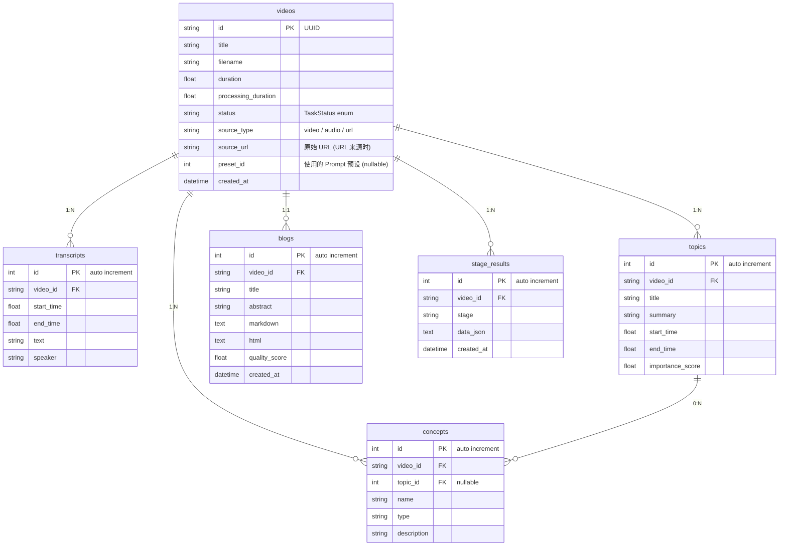

### 任务状态流转

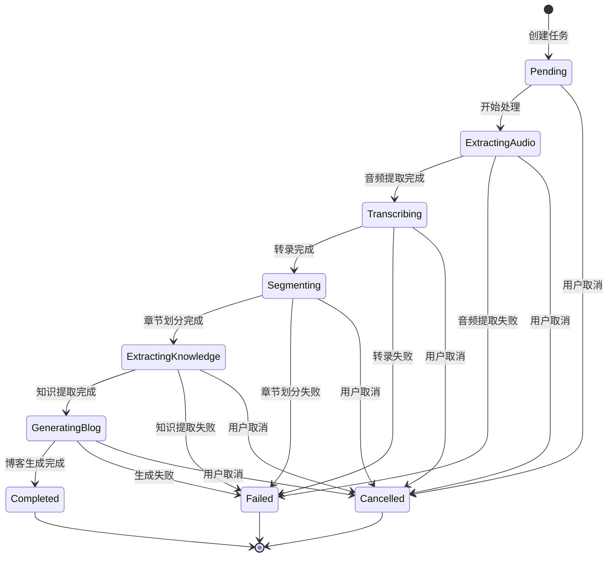

---

## API 接口

所有 API 端点定义在 [backend/app/main.py](backend/app/main.py)，启动后访问 http://localhost:8001/docs 查看交互式文档。

### 核心端点

| 方法 | 路径 | 说明 |
| ---- | ---- | ---- |
| `POST` | `/api/upload` | 上传视频/音频文件，启动处理流水线 |
| `POST` | `/api/upload/url` | 提交 URL 链接，通过 yt-dlp 下载并处理 |
| `GET` | `/api/task/{id}/stream` | SSE 实时进度流 |
| `GET` | `/api/task/{id}` | 查询任务状态 |
| `POST` | `/api/task/{id}/cancel` | 取消任务 |
| `GET` | `/api/videos` | 视频列表（支持搜索和状态筛选） |
| `GET` | `/api/videos/{id}` | 视频详情 |
| `DELETE` | `/api/videos/{id}` | 删除视频 |
| `POST` | `/api/videos/{id}/reprocess` | 重新处理 |
| `POST` | `/api/videos/{id}/regenerate-blog` | 仅重新生成博客（保留转录和知识） |
| `GET` | `/api/blog/{id}` | 获取博客内容 |
| `GET` | `/api/video/{id}` | 获取原始视频文件 |
| `GET` | `/api/audio/{id}` | 获取音频文件 |
| `POST` | `/api/export/md` | 导出 Markdown |
| `POST` | `/api/export/srt` | 导出 SRT 字幕 |
| `POST` | `/api/export/txt` | 导出纯文本 |
| `POST` | `/api/export/json` | 导出 JSON |
| `GET` | `/api/prompts` | 获取 Prompt 模板列表 |
| `PUT` | `/api/prompts/{id}` | 更新 Prompt 模板 |
| `GET` | `/api/presets` | 获取 Prompt 预设列表 |
| `POST` | `/api/presets` | 创建 Prompt 预设 |
| `PUT` | `/api/presets/{id}` | 更新 Prompt 预设 |
| `DELETE` | `/api/presets/{id}` | 删除 Prompt 预设 |

### SSE 事件类型

| 事件 | Payload | 说明 |
| ---- | ---- | ---- |
| `step_start` | `{step, message}` | 步骤开始 |
| `step_progress` | `{step, progress_pct, detail}` | 步骤进度（百分比） |
| `step_result` | `{step, ...data}` | 步骤完成，含中间结果 |
| `step_error` | `{step, message}` | 步骤错误 |
| `complete` | `{blog_id}` | 全流程完成 |
| `cancelled` | `{message}` | 任务被取消 |
| `ping` | `{}` | 30 秒保活心跳 |

---

## Roadmap

- [x] 多源输入支持（视频/音频/URL）
- [x] 语音转录（faster-whisper large-v3）
- [x] 章节划分与知识提取
- [x] 流式博客生成（打字机效果）
- [x] SSE 实时进度推送
- [x] Prompt 模板编辑与预设管理
- [x] 多格式导出（Markdown/SRT/TXT/JSON）
- [x] 资产管理（搜索/筛选/删除/重新处理）
- [ ] 批量处理支持（队列管理）
- [ ] 博客质量评分与自动优化
- [ ] 多语言博客生成（英文/日文等）
- [ ] 支持更多 LLM（OpenAI、Claude、本地模型）
- [ ] Docker 容器化部署
- [ ] 协作功能（多人共享任务）

---

## 贡献指南

欢迎贡献！请遵循以下流程：

1. Fork 本仓库
2. 创建特性分支：`git checkout -b feature/your-feature`
3. 提交更改：`git commit -m 'feat: add your feature'`
4. 推送分支：`git push origin feature/your-feature`
5. 提交 Pull Request

### 开发环境

```bash
# 后端
cd backend
conda activate video2techblog
pip install -r requirements.txt
uvicorn app.main:app --reload --port 8001

# 前端
cd frontend
npm install
npm run dev
npm run lint  # 代码检查
```

### 提交规范

使用 [Conventional Commits](https://www.conventionalcommits.org/) 规范：

- `feat:` 新功能
- `fix:` Bug 修复
- `docs:` 文档更新
- `refactor:` 代码重构
- `chore:` 构建/工具变更

---

## FAQ

### 支持哪些输入方式？

三种：① 上传视频文件（MP4、MKV、AVI、MOV 等）；② 上传音频文件（MP3、WAV、M4A 等）；③ 粘贴 URL 链接（Bilibili、YouTube、抖音等 1000+ 平台）。

### URL 输入下载失败怎么办？

常见原因：① 平台需要登录态 → 配置 cookies 文件；② 网络问题（YouTube 需要代理）→ 配置 `HTTP_PROXY` 环境变量；③ 链接失效或私有视频 → 检查链接是否可公开访问。

### 最大支持多大的视频？

默认 500MB，可通过 `MAX_VIDEO_SIZE_MB` 配置调整。URL 输入无大小限制，取决于网络带宽。

### 没有 GPU 能用吗？

可以。Whisper 模型会自动回退到 CPU 模式（int8 精度），转录速度会慢一些但功能完整。

### 支持哪些语言？

Whisper 支持 99 种语言的转录，系统会自动检测。如需固定某种语言，可在 `backend/.env` 中设置 `WHISPER_LANGUAGE=zh`（中文）或 `WHISPER_LANGUAGE=en`（英文）。LLM 生成的博客默认中文，可通过修改 Prompt 模板切换。

### DeepSeek API 费用大概多少？

一个 30 分钟的视频，章节划分 + 知识提取 + 博客生成大约消耗 10-20K tokens，具体费用请参考 [DeepSeek 定价](https://platform.deepseek.com/api-docs/pricing/)。

### 可以使用其他 LLM 吗？

当前硬编码使用 DeepSeek API。如需替换其他 OpenAI 兼容的 API，修改 `backend/app/config.py` 中的 `DEEPSEEK_BASE_URL` 和 `DEEPSEEK_MODEL` 即可。

### 页面刷新后进度会丢失吗？

不会。SSE 管理器会记录所有已发送的事件，页面刷新后自动回放历史事件。

### 如何自定义博客的写作风格？

通过界面右上角的「Prompt 设置」按钮，编辑博客生成的 System Prompt 和 User Prompt。还可以创建预设方案，一键切换不同风格。

---

## License

[MIT License](LICENSE) © 2026 [guyue356](https://github.com/guyue356)
