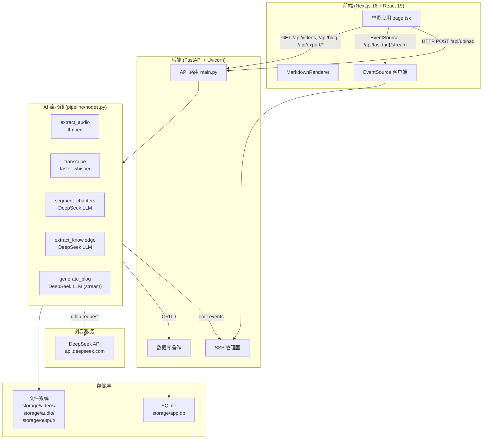
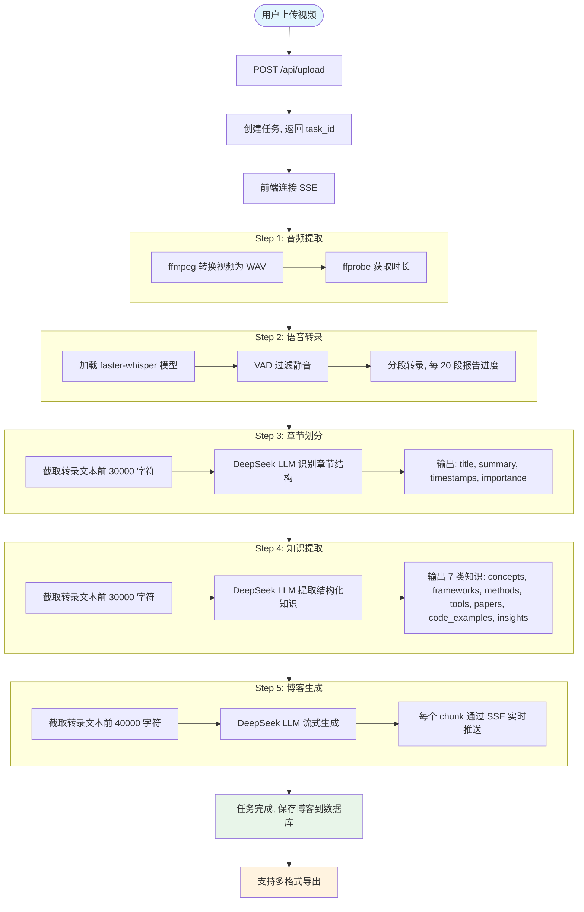
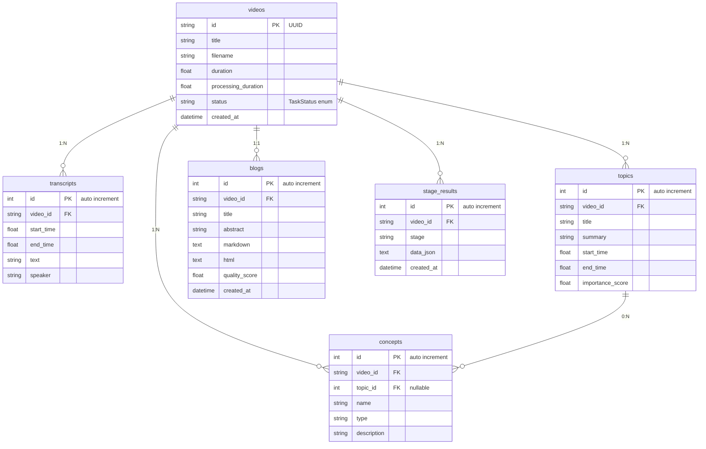

# Video2TechBlog

**将技术视频一键转化为可发布的技术博客文章。**

[](https://www.python.org/)
[](https://nextjs.org/)
[](https://fastapi.tiangolo.com/)
[](LICENSE)

---

## 项目简介

在技术社区中，视频教程和会议演讲是重要的知识载体，但视频内容难以检索、不便引用、无法快速浏览。**Video2TechBlog** 通过 AI 流水线自动将技术视频转化为结构化的中文技术博客，让视频知识变得可搜索、可引用、可分享。

用户只需上传一个视频文件，系统会自动完成：

1. **音频提取** — ffmpeg 提取 16kHz 单声道 WAV
2. **语音转录** — faster-whisper large-v3 模型精准识别中文语音
3. **章节划分** — DeepSeek LLM 识别视频的逻辑章节结构
4. **知识提取** — 提取概念、框架、方法、工具、代码示例等 7 类知识
5. **博客生成** — 流式生成中文技术博客，前端实时展示（打字机效果）

整个过程通过 **SSE（Server-Sent Events）** 实时推送进度，用户可以随时取消任务。处理完成后支持导出为 Markdown、HTML、SRT 字幕、纯文本等多种格式。

---

## 核心能力

| 能力 | 说明 |
|------|------|
| 🎬 视频上传 | 拖拽上传，支持最大 500MB 视频文件 |
| 🎙️ 语音转录 | faster-whisper large-v3，自动检测 GPU/CPU，自动检测语言（中英文） |
| 📑 章节识别 | LLM 自动识别视频逻辑结构，输出章节标题、摘要、时间戳、重要性评分 |
| 🧠 知识提取 | 结构化提取 7 类知识：概念、框架、方法、工具、论文、代码示例、洞见 |
| ✍️ 博客生成 | 流式生成中文技术博客，实时打字机效果 |
| 📊 实时进度 | SSE 推送每个步骤的进度、状态和中间结果 |
| 📤 多格式导出 | Markdown、SRT 字幕、纯文本、JSON |
| 🔄 任务管理 | 支持取消、重新处理，视频资产列表管理 |

---

## 效果展示

### 处理流程

```
┌─────────────┐    ┌─────────────┐    ┌─────────────┐    ┌─────────────┐    ┌─────────────┐
│  音频提取   │ -> │  语音转录   │ -> │  章节划分   │ -> │  知识提取   │ -> │  博客生成   │
│   ffmpeg    │    │  whisper    │    │  DeepSeek   │    │  DeepSeek   │    │  DeepSeek   │
└─────────────┘    └─────────────┘    └─────────────┘    └─────────────┘    └─────────────┘
     WAV 16kHz        时间戳文本        章节 + 摘要       7 类结构化知识      流式 Markdown
```

### 前端界面

前端提供两个核心视图：

- **上传视图** — 拖拽上传视频 → 实时进度条 → 5 个 Tab 展示各阶段结果（音频、转录、章节、知识、博客）
- **资产视图** — 视频列表管理，支持搜索、状态筛选、查看详情、删除、重新处理

---

## 应用场景

- **技术会议** — 将技术演讲视频转化为可发布的博客文章
- **在线教程** — 将视频教程转化为图文教程，方便检索和引用
- **团队知识库** — 将内部技术分享视频转化为团队文档
- **个人学习** — 将学习视频转化为结构化笔记
- **内容创作** — 快速将视频内容转化为文字素材

---

## 系统架构



---

## 核心工作流程



---

## 技术栈

### 后端

| 层级 | 技术 | 用途 |
|------|------|------|
| 运行时 | Python 3.10 | 通过 Conda 管理环境 |
| Web 框架 | FastAPI + Uvicorn | 异步 HTTP 服务，自动 OpenAPI 文档 |
| ORM | SQLAlchemy + aiosqlite | 异步数据库操作 |
| 数据库 | SQLite | 轻量级本地存储，零配置 |
| 语音转录 | faster-whisper (large-v3) | OpenAI Whisper 的高效实现 |
| LLM | DeepSeek (deepseek-v4-pro) | 章节划分、知识提取、博客生成 |
| 音视频 | ffmpeg | 音频提取，格式转换 |
| SSE | sse-starlette | Server-Sent Events 推送 |
| Markdown | mistune | Markdown 转 HTML |
| 数据校验 | Pydantic | 请求/响应模型校验 |

### 前端

| 层级 | 技术 | 用途 |
|------|------|------|
| 框架 | Next.js 16 (App Router) | React 全栈框架 |
| UI 库 | React 19 | 组件化 UI |
| 样式 | Tailwind CSS 4 + @tailwindcss/typography | 原子化 CSS + 排版插件 |
| Markdown | react-markdown + remark-gfm + rehype-highlight | Markdown 渲染 + 代码高亮 |
| 类型 | TypeScript 5 | 类型安全 |
| 状态管理 | useState / useRef | 无外部状态库，轻量级 |

---

## 项目结构

```
Video2TechBlog/
├── backend/                     # Python FastAPI 后端
│   ├── app/
│   │   ├── main.py              # API 路由定义（所有端点）
│   │   ├── config.py            # 配置管理（环境变量 + 常量）
│   │   ├── models/
│   │   │   └── database.py      # SQLAlchemy 模型 + 数据库初始化
│   │   └── pipeline/
│   │       ├── nodes.py         # 5 步流水线实现（核心逻辑）
│   │       ├── graph.py         # 流水线入口（re-export run_pipeline）
│   │       └── sse_manager.py   # SSE 事件管理器（asyncio.Queue）
│   ├── requirements.txt         # Python 依赖
│   └── .env                     # 环境变量（DEEPSEEK_API_KEY 等）
│
├── frontend/                    # Next.js 前端
│   ├── src/app/
│   │   ├── page.tsx             # 主页面（1300+ 行，单页应用）
│   │   └── MarkdownRenderer.tsx # Markdown 渲染组件
│   ├── package.json             # Node.js 依赖
│   └── tailwind.config.ts       # Tailwind CSS 配置
│
├── storage/                     # 运行时数据（gitignored）
│   ├── videos/                  # 上传的视频文件
│   ├── audio/                   # 提取的音频文件
│   ├── output/                  # 导出的文件
│   └── app.db                   # SQLite 数据库
│
├── start.ps1                    # Windows PowerShell 一键启动脚本
├── start.bat                    # Windows 批处理启动脚本
├── CLAUDE.md                    # Claude Code 项目指引
├── PRD_craft.md                 # 产品需求文档
└── LICENSE                      # MIT 许可证
```

---

## 安装部署

### 环境要求

- **Conda** — Python 环境管理（[安装 Miniconda](https://docs.conda.io/en/latest/miniconda.html)）
- **Node.js** — 前端构建（[下载](https://nodejs.org/)）
- **ffmpeg** — 音频提取（见下方安装方式）

### ffmpeg 安装

```powershell
# 方式 1: winget
winget install ffmpeg

# 方式 2: 手动下载
# 从 https://github.com/BtbN/FFmpeg-Builds/releases 下载
# 解压到 C:\ffmpeg\，确保 C:\ffmpeg\bin\ffmpeg.exe 存在

# 方式 3: 从 https://www.gyan.dev/ffmpeg/builds/ 下载
```

### 配置 API Key

在 `backend/` 目录下创建 `.env` 文件：

```bash
DEEPSEEK_API_KEY=sk-your-api-key-here
WHISPER_LANGUAGE=zh
```

> **获取 API Key**：前往 [DeepSeek 开放平台](https://platform.deepseek.com/) 注册并创建 API Key。

---

## 快速开始

### 方式一：一键启动（推荐）

```powershell
.\start.ps1
```

脚本会自动：
1. 检查 Conda、Node.js、ffmpeg 是否安装
2. 创建 `video2techblog` Conda 环境（Python 3.10）
3. 安装 Python 和 Node.js 依赖
4. 在同一窗口启动后端（端口 8000）和前端（端口 3000）

启动后访问：
- **前端界面**：http://localhost:3000
- **API 文档**：http://localhost:8000/docs

### 方式二：手动启动

```bash
# 终端 1：启动后端
cd backend
conda activate video2techblog
pip install -r requirements.txt
uvicorn app.main:app --reload --port 8000

# 终端 2：启动前端
cd frontend
npm install
npm run dev
```

---

## 使用说明

### 上传视频

1. 打开 http://localhost:3000
2. 将视频文件拖拽到上传区域，或点击选择文件
3. 系统自动开始处理，实时显示 5 个步骤的进度

### 查看结果

处理完成后，页面会展示 6 个标签页：

| 标签 | 内容 |
|------|------|
| 🎬 视频 | 原始视频播放器 |
| 🎵 音频 | 音频文件信息和播放器 |
| ✎ 转录 | 带时间戳的逐段转录文本 |
| ☰ 章节 | 章节列表，含标题、摘要、时间范围、重要性评分 |
| ★ 知识 | 结构化知识：概念、框架、方法、工具、代码示例等 |
| 📝 博客 | 生成的 Markdown 博客文章（带代码高亮） |

### 导出

博客支持多种格式导出：
- **Markdown** (.md) — 原始 Markdown 文件
- **SRT** (.srt) — 字幕文件
- **TXT** (.txt) — 纯文本转录
- **JSON** (.json) — 任意阶段的结构化数据

### 资产管理

切换到"资产"视图可以：
- 查看所有已处理的视频列表
- 按状态筛选（处理中、已完成、失败）
- 搜索视频
- 重新处理视频
- 删除视频及其所有关联数据

---

## 配置说明

所有配置在 [backend/app/config.py](backend/app/config.py) 中定义，通过环境变量覆盖：

| 配置项 | 默认值 | 说明 |
|--------|--------|------|
| `DEEPSEEK_API_KEY` | `""` | DeepSeek API 密钥（**必需**） |
| `DEEPSEEK_BASE_URL` | `https://api.deepseek.com/v1` | API 基础 URL |
| `DEEPSEEK_MODEL` | `deepseek-v4-pro` | LLM 模型名称 |
| `WHISPER_MODEL_SIZE` | `large-v3` | Whisper 模型大小 |
| `WHISPER_DEVICE` | 自动检测 | 计算设备（cuda/cpu） |
| `WHISPER_COMPUTE_TYPE` | 自动检测 | 计算精度（int8_float16/int8） |
| `WHISPER_LANGUAGE` | `` (空) | 转录语言（空为自动检测，支持中英文） |
| `MAX_VIDEO_SIZE_MB` | `500` | 最大视频文件大小 |
| `AUDIO_SAMPLE_RATE` | `16000` | 音频采样率 |

---

## API 接口

所有 API 端点定义在 [backend/app/main.py](backend/app/main.py)，启动后访问 http://localhost:8000/docs 查看交互式文档。

### 核心端点

| 方法 | 路径 | 说明 |
|------|------|------|
| `POST` | `/api/upload` | 上传视频，启动处理流水线 |
| `GET` | `/api/task/{id}/stream` | SSE 实时进度流 |
| `GET` | `/api/task/{id}` | 查询任务状态 |
| `POST` | `/api/task/{id}/cancel` | 取消任务 |
| `GET` | `/api/videos` | 视频列表（支持搜索和状态筛选） |
| `GET` | `/api/videos/{id}` | 视频详情 |
| `DELETE` | `/api/videos/{id}` | 删除视频 |
| `POST` | `/api/videos/{id}/reprocess` | 重新处理 |
| `GET` | `/api/blog/{id}` | 获取博客内容 |
| `GET` | `/api/video/{id}` | 获取原始视频文件 |
| `GET` | `/api/audio/{id}` | 获取音频文件 |
| `POST` | `/api/export/md` | 导出 Markdown |
| `POST` | `/api/export/srt` | 导出 SRT 字幕 |

### SSE 事件类型

| 事件 | Payload | 说明 |
|------|---------|------|
| `step_start` | `{step, message}` | 步骤开始 |
| `step_progress` | `{step, progress_pct, detail}` | 步骤进度（百分比） |
| `step_result` | `{step, ...data}` | 步骤完成，含中间结果 |
| `step_error` | `{step, message}` | 步骤错误 |
| `complete` | `{blog_id}` | 全流程完成 |
| `cancelled` | `{message}` | 任务被取消 |
| `ping` | `{}` | 30 秒保活心跳 |

---

## 数据库设计

使用 SQLAlchemy async + aiosqlite，数据库文件：`storage/app.db`。



### 任务状态流转

```
PENDING -> EXTRACTING_AUDIO -> TRANSCRIBING -> SEGMENTING ->
EXTRACTING_KNOWLEDGE -> GENERATING_BLOG -> COMPLETED
                                                  |
                                                  +-> FAILED
                                                  +-> CANCELLED
```

---

## 项目亮点

### 1. 异步架构设计

后端基于 FastAPI 的异步架构，CPU 密集型操作（Whisper 转录、ffmpeg 提取）通过 `run_in_executor` 在线程池中执行，避免阻塞 asyncio 事件循环，确保 SSE 推送的实时性。

### 2. 流式博客生成

博客生成步骤使用 DeepSeek 的流式 API，通过 `asyncio.Queue` 在同步 LLM 流和异步 SSE 推送之间桥接，实现前端实时打字机效果，用户体验流畅。

### 3. 自定义 SSE 管理器

不依赖 LangGraph 的 Callbacks 机制，而是实现了轻量级的 `SSEManager`：每个任务维护独立的 `asyncio.Queue` 和事件历史列表，支持实时推送和页面刷新后的事件回放。

### 4. LLM 直连调用

所有 LLM 调用通过 `urllib.request` 直接构建 HTTP 请求，而非使用 openai SDK，减少了依赖复杂度，同时支持普通调用和流式调用两种模式。

### 5. 阶段结果持久化

每个处理阶段的完整数据以 JSON 形式存储在 `stage_results` 表中，支持后续查看任意阶段的中间结果和多格式导出。

### 6. 自动设备检测

Whisper 模型自动检测 CUDA 支持，优先使用 GPU（int8_float16 精度），回退到 CPU（int8 精度），最大化兼容性。

---

## Roadmap

- [ ] 支持更多视频源（YouTube 链接、Bilibili 链接）
- [x] 支持英文及中文视频的自动语言检测和转录
- [ ] 博客编辑功能（在线修改生成的博客）
- [ ] 批量处理多个视频
- [ ] 自定义博客模板和风格
- [ ] 集成更多 LLM（GPT-4、Claude、Gemini）
- [ ] 添加用户认证和多租户支持
- [ ] Docker 容器化部署
- [ ] 支持 Whisper large-v3-turbo 模型（更快）

---

## 贡献指南

欢迎贡献！请遵循以下流程：

1. Fork 本仓库
2. 创建特性分支：`git checkout -b feature/your-feature`
3. 提交更改：`git commit -m 'Add your feature'`
4. 推送分支：`git push origin feature/your-feature`
5. 提交 Pull Request

### 开发环境

```bash
# 后端
cd backend
conda activate video2techblog
pip install -r requirements.txt
uvicorn app.main:app --reload --port 8000

# 前端
cd frontend
npm install
npm run dev
npm run lint  # 代码检查
```

---

## FAQ

**Q: 支持哪些视频格式？**

A: 支持 ffmpeg 能处理的所有格式，包括 MP4、MKV、AVI、MOV、WebM 等。

**Q: 最大支持多大的视频？**

A: 默认 500MB，可通过 `MAX_VIDEO_SIZE_MB` 配置调整。

**Q: 没有 GPU 能用吗？**

A: 可以。Whisper 模型会自动回退到 CPU 模式（int8 精度），转录速度会慢一些但功能完整。

**Q: 支持哪些语言的视频？**

A: 系统会自动检测视频语言，支持中文和英文。如需固定某种语言，可在 `backend/.env` 中设置 `WHISPER_LANGUAGE=zh`（中文）或 `WHISPER_LANGUAGE=en`（英文）。

**Q: DeepSeek API 费用大概多少？**

A: 一个 30 分钟的视频，章节划分 + 知识提取 + 博客生成大约消耗 10-20K tokens，具体费用请参考 [DeepSeek 定价](https://platform.deepseek.com/api-docs/pricing/)。

**Q: 页面刷新后进度会丢失吗？**

A: 不会。SSE 管理器会记录所有已发送的事件，页面刷新后通过 `/api/task/{id}/events` 接口回放历史事件。

---

## License

[MIT License](LICENSE) © 2026 [guyue356](https://github.com/guyue356)
